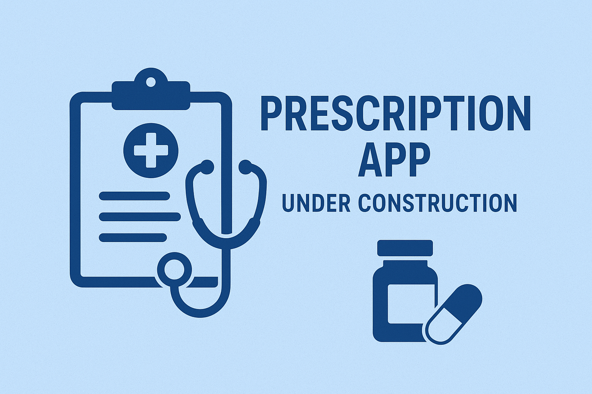

## 💊 Prescription App (Interview Assessment)

A simple **web-based prescription management system** built using **Spring Boot** and **Maven**, developed as part of an **interview technical assessment**.  
This application allows authenticated users to create, view, update, and delete prescriptions, along with generating reports and REST API access.

## 🧠 Tech Stack
- **Java 17+**
- **Spring Boot 3**
- **Spring MVC**
- **Spring Data JPA**
- **H2 Database** (in-memory for easy setup)
- **Thymeleaf / REST API** (for frontend display & API access)
- **Maven** (build & dependency management)
## 🚀 Features (Planned / In Progress)
- User Authentication (no anonymous access)
- CRUD operations for prescriptions
- Input validation & error handling
- Report: Day-wise prescription count
- REST API: `/api/v1/prescription`
- External API integration: RxNav drug interaction
## 📌 Note

This project is currently under development as part of an interview assessment, focusing on clean code structure, best practices, and maintainable architecture.